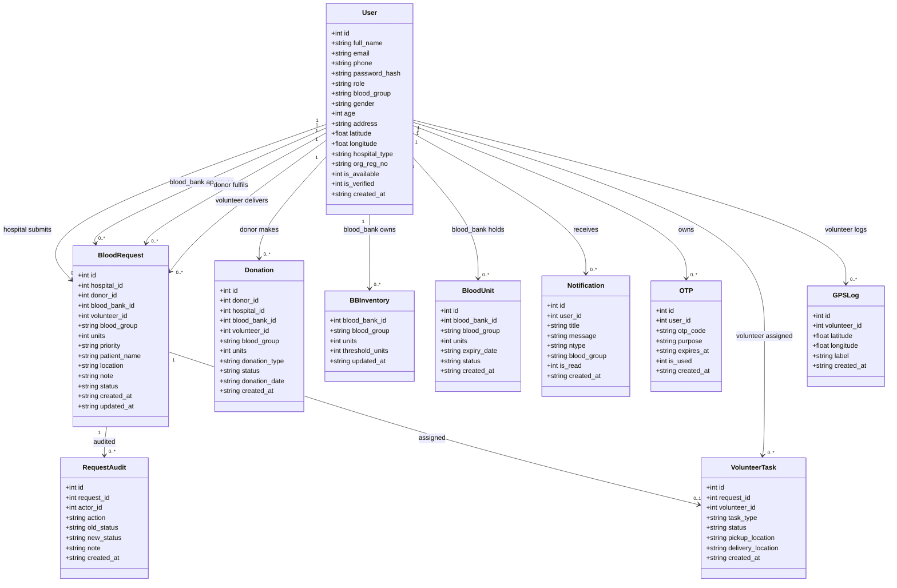
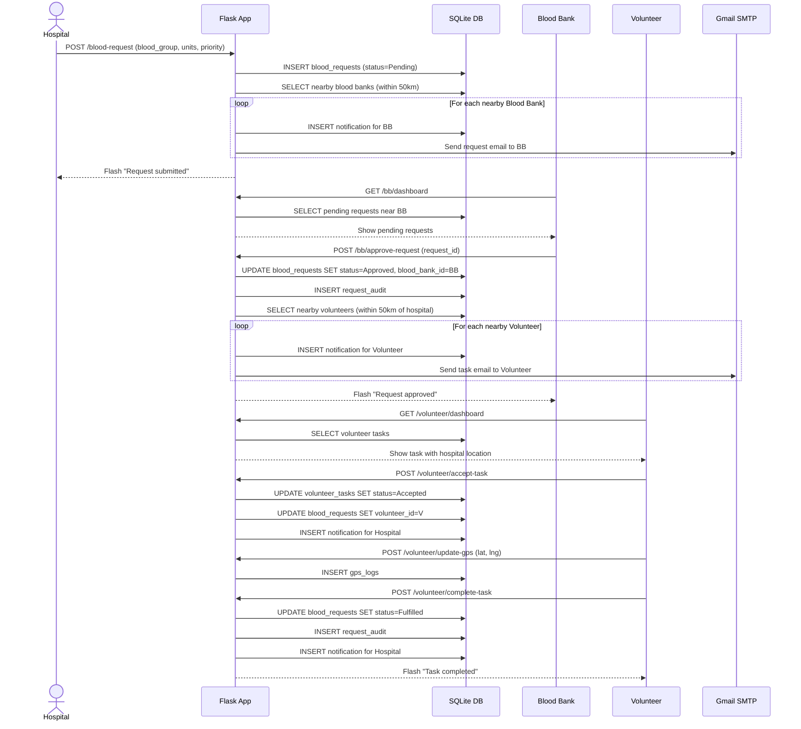
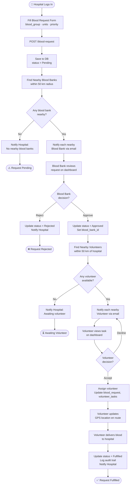

# BloodFlow — UML Diagrams

---

## 1. Use Case Diagram

```mermaid
graph TB
    subgraph Actors
        A(👨‍💼 Admin)
        D(🩸 Donor)
        H(🏥 Hospital)
        BB(🏦 Blood Bank)
        V(🚗 Volunteer)
        SYS(⚙️ System)
    end

    subgraph BloodFlow System
        UC1["Register & Verify OTP"]
        UC2["Login / Logout"]
        UC3["View Dashboard"]
        UC4["Submit Blood Request"]
        UC5["Approve Blood Request"]
        UC6["Reject Blood Request"]
        UC7["Accept Delivery Task"]
        UC8["Track GPS Location"]
        UC9["Donate Blood"]
        UC10["Manage Inventory"]
        UC11["Edit BB Inventory"]
        UC12["Manage Users"]
        UC13["View All Requests"]
        UC14["Send Notifications"]
        UC15["Send OTP Email"]
        UC16["View Nearby Blood Banks"]
        UC17["View Donor Directory"]
        UC18["Submit Incident Report"]
        UC19["Edit Profile"]
    end

    A --> UC2
    A --> UC3
    A --> UC12
    A --> UC13
    A --> UC10

    D --> UC1
    D --> UC2
    D --> UC3
    D --> UC9
    D --> UC19

    H --> UC1
    H --> UC2
    H --> UC3
    H --> UC4
    H --> UC16
    H --> UC19

    BB --> UC1
    BB --> UC2
    BB --> UC3
    BB --> UC5
    BB --> UC6
    BB --> UC11
    BB --> UC17
    BB --> UC18

    V --> UC1
    V --> UC2
    V --> UC3
    V --> UC7
    V --> UC8
    V --> UC19

    SYS --> UC14
    SYS --> UC15
    UC4 --> UC14
    UC5 --> UC14
    UC1 --> UC15
```

---

## 2. Class Diagram

```mermaid
classDiagram
    class User {
        +int id
        +string full_name
        +string email
        +string phone
        +string password_hash
        +string role
        +string blood_group
        +string gender
        +int age
        +string address
        +float latitude
        +float longitude
        +string hospital_type
        +string org_reg_no
        +int is_available
        +int is_verified
        +string created_at
    }

    class BloodRequest {
        +int id
        +int hospital_id
        +int donor_id
        +int blood_bank_id
        +int volunteer_id
        +string blood_group
        +int units
        +string priority
        +string patient_name
        +string location
        +string note
        +string status
        +string created_at
        +string updated_at
    }

    class Donation {
        +int id
        +int donor_id
        +int hospital_id
        +int blood_bank_id
        +int volunteer_id
        +string blood_group
        +int units
        +string donation_type
        +string status
        +string donation_date
        +string created_at
    }

    class BBInventory {
        +int blood_bank_id
        +string blood_group
        +int units
        +int threshold_units
        +string updated_at
    }

    class Notification {
        +int id
        +int user_id
        +string title
        +string message
        +string ntype
        +string blood_group
        +int is_read
        +string created_at
    }

    class OTP {
        +int id
        +int user_id
        +string otp_code
        +string purpose
        +string expires_at
        +int is_used
        +string created_at
    }

    class VolunteerTask {
        +int id
        +int request_id
        +int volunteer_id
        +string task_type
        +string status
        +string pickup_location
        +string delivery_location
        +string created_at
    }

    class GPSLog {
        +int id
        +int volunteer_id
        +float latitude
        +float longitude
        +string label
        +string created_at
    }

    class RequestAudit {
        +int id
        +int request_id
        +int actor_id
        +string action
        +string old_status
        +string new_status
        +string note
        +string created_at
    }

    class BloodUnit {
        +int id
        +int blood_bank_id
        +string blood_group
        +int units
        +string expiry_date
        +string status
        +string created_at
    }

    User "1" --> "0..*" BloodRequest : hospital submits
    User "1" --> "0..*" BloodRequest : blood_bank approves
    User "1" --> "0..*" BloodRequest : donor fulfils
    User "1" --> "0..*" BloodRequest : volunteer delivers
    User "1" --> "0..*" Donation : donor makes
    User "1" --> "0..*" BBInventory : blood_bank owns
    User "1" --> "0..*" BloodUnit : blood_bank holds
    User "1" --> "0..*" Notification : receives
    User "1" --> "0..*" OTP : owns
    User "1" --> "0..*" VolunteerTask : volunteer assigned
    User "1" --> "0..*" GPSLog : volunteer logs
    BloodRequest "1" --> "0..*" RequestAudit : audited
    BloodRequest "1" --> "0..1" VolunteerTask : assigned
```

---

## 3. Sequence Diagram — Blood Request Flow

```mermaid
sequenceDiagram
    actor H as Hospital
    participant App as Flask App
    participant DB as SQLite DB
    participant BB as Blood Bank
    participant V as Volunteer
    participant Email as Gmail SMTP

    H->>App: POST /blood-request (blood_group, units, priority)
    App->>DB: INSERT blood_requests (status=Pending)
    App->>DB: SELECT nearby blood banks (within 50km)
    loop For each nearby Blood Bank
        App->>DB: INSERT notification for BB
        App->>Email: Send request email to BB
    end
    App-->>H: Flash "Request submitted"

    BB->>App: GET /bb/dashboard
    App->>DB: SELECT pending requests near BB
    App-->>BB: Show pending requests

    BB->>App: POST /bb/approve-request (request_id)
    App->>DB: UPDATE blood_requests SET status=Approved, blood_bank_id=BB
    App->>DB: INSERT request_audit
    App->>DB: SELECT nearby volunteers (within 50km of hospital)
    loop For each nearby Volunteer
        App->>DB: INSERT notification for Volunteer
        App->>Email: Send task email to Volunteer
    end
    App-->>BB: Flash "Request approved"

    V->>App: GET /volunteer/dashboard
    App->>DB: SELECT volunteer tasks
    App-->>V: Show task with hospital location

    V->>App: POST /volunteer/accept-task
    App->>DB: UPDATE volunteer_tasks SET status=Accepted
    App->>DB: UPDATE blood_requests SET volunteer_id=V
    App->>DB: INSERT notification for Hospital

    V->>App: POST /volunteer/update-gps (lat, lng)
    App->>DB: INSERT gps_logs

    V->>App: POST /volunteer/complete-task
    App->>DB: UPDATE blood_requests SET status=Fulfilled
    App->>DB: INSERT request_audit
    App->>DB: INSERT notification for Hospital
    App-->>V: Flash "Task completed"
```

---

## 4. Activity Diagram — Blood Request Lifecycle

```mermaid
flowchart TD
    START([🏥 Hospital Logs In]) --> FORM[Fill Blood Request Form\nblood_group · units · priority]
    FORM --> SUBMIT[POST /blood-request]
    SUBMIT --> SAVE[Save to DB\nstatus = Pending]
    SAVE --> FIND[Find Nearby Blood Banks\nwithin 50 km radius]
    FIND --> ANY_BB{Any blood bank\nnearby?}

    ANY_BB -- No --> ALERT[Notify Hospital:\nNo nearby blood banks]
    ALERT --> END1([⚠️ Request Pending])

    ANY_BB -- Yes --> NOTIFY_BB[Notify each nearby\nBlood Bank via email]
    NOTIFY_BB --> BB_REVIEW[Blood Bank reviews\nrequest on dashboard]
    BB_REVIEW --> BB_DECIDE{Blood Bank\ndecision?}

    BB_DECIDE -- Reject --> REJECT[Update status = Rejected\nNotify Hospital]
    REJECT --> END2([❌ Request Rejected])

    BB_DECIDE -- Approve --> APPROVE[Update status = Approved\nSet blood_bank_id]
    APPROVE --> FIND_VOL[Find Nearby Volunteers\nwithin 50 km of hospital]
    FIND_VOL --> ANY_VOL{Any volunteer\navailable?}

    ANY_VOL -- No --> WAIT_VOL[Notify Hospital:\nAwaiting volunteer]
    WAIT_VOL --> END3([⏳ Awaiting Volunteer])

    ANY_VOL -- Yes --> NOTIFY_VOL[Notify each nearby\nVolunteer via email]
    NOTIFY_VOL --> VOL_REVIEW[Volunteer views task\non dashboard]
    VOL_REVIEW --> VOL_DECIDE{Volunteer\ndecision?}

    VOL_DECIDE -- Decline --> NOTIFY_VOL

    VOL_DECIDE -- Accept --> ASSIGN[Assign volunteer\nUpdate blood_request, volunteer_tasks]
    ASSIGN --> GPS[Volunteer updates\nGPS location en route]
    GPS --> DELIVER[Volunteer delivers blood\nto hospital]
    DELIVER --> COMPLETE[Update status = Fulfilled\nLog audit trail\nNotify Hospital]
    COMPLETE --> END4([✅ Request Fulfilled])
```
